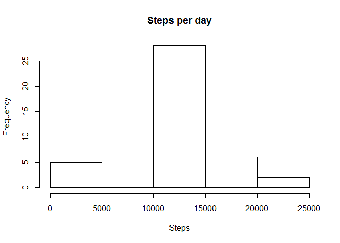
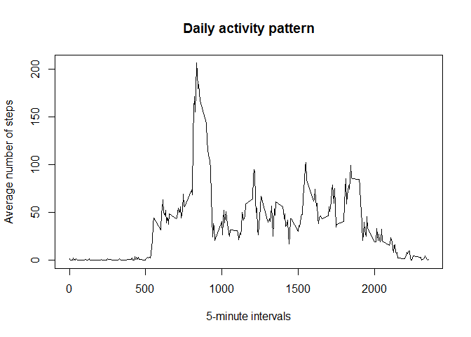
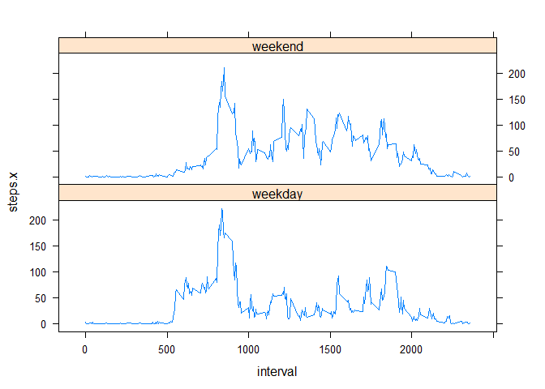

Loading and preprocessing the data
----------------------------------

    mydata <- read.csv("activity.csv", sep=",", header = TRUE)

What is mean total number of steps taken per day?
-------------------------------------------------

For this part of the assignment, i can ignore the missing values in the
dataset.

A histogram of the total number of steps taken each day

    ag <- aggregate(steps~date, data=mydata, sum)
    hist(ag$steps, main="Steps per day", xlab="Steps")

The mean and median of the total number of steps taken per day

    ag1 <- aggregate(steps~date, data=mydata, mean)
    ag2 <- aggregate(steps~date, data=mydata, median)
    ag <- merge(ag1, ag2, by = c(1,1))
    names(ag) <- c("date", "mean", "median")
    ag

    ##          date       mean median
    ## 1  2012-10-02  0.4375000      0
    ## 2  2012-10-03 39.4166667      0
    ## 3  2012-10-04 42.0694444      0
    ## 4  2012-10-05 46.1597222      0
    ## 5  2012-10-06 53.5416667      0
    ## 6  2012-10-07 38.2465278      0
    ## 7  2012-10-09 44.4826389      0
    ## 8  2012-10-10 34.3750000      0
    ## 9  2012-10-11 35.7777778      0
    ## 10 2012-10-12 60.3541667      0
    ## 11 2012-10-13 43.1458333      0
    ## 12 2012-10-14 52.4236111      0
    ## 13 2012-10-15 35.2048611      0
    ## 14 2012-10-16 52.3750000      0
    ## 15 2012-10-17 46.7083333      0
    ## 16 2012-10-18 34.9166667      0
    ## 17 2012-10-19 41.0729167      0
    ## 18 2012-10-20 36.0937500      0
    ## 19 2012-10-21 30.6284722      0
    ## 20 2012-10-22 46.7361111      0
    ## 21 2012-10-23 30.9652778      0
    ## 22 2012-10-24 29.0104167      0
    ## 23 2012-10-25  8.6527778      0
    ## 24 2012-10-26 23.5347222      0
    ## 25 2012-10-27 35.1354167      0
    ## 26 2012-10-28 39.7847222      0
    ## 27 2012-10-29 17.4236111      0
    ## 28 2012-10-30 34.0937500      0
    ## 29 2012-10-31 53.5208333      0
    ## 30 2012-11-02 36.8055556      0
    ## 31 2012-11-03 36.7048611      0
    ## 32 2012-11-05 36.2465278      0
    ## 33 2012-11-06 28.9375000      0
    ## 34 2012-11-07 44.7326389      0
    ## 35 2012-11-08 11.1770833      0
    ## 36 2012-11-11 43.7777778      0
    ## 37 2012-11-12 37.3784722      0
    ## 38 2012-11-13 25.4722222      0
    ## 39 2012-11-15  0.1423611      0
    ## 40 2012-11-16 18.8923611      0
    ## 41 2012-11-17 49.7881944      0
    ## 42 2012-11-18 52.4652778      0
    ## 43 2012-11-19 30.6979167      0
    ## 44 2012-11-20 15.5277778      0
    ## 45 2012-11-21 44.3993056      0
    ## 46 2012-11-22 70.9270833      0
    ## 47 2012-11-23 73.5902778      0
    ## 48 2012-11-24 50.2708333      0
    ## 49 2012-11-25 41.0902778      0
    ## 50 2012-11-26 38.7569444      0
    ## 51 2012-11-27 47.3819444      0
    ## 52 2012-11-28 35.3576389      0
    ## 53 2012-11-29 24.4687500      0

What is the average daily activity pattern?
-------------------------------------------

A time series plot of the 5-minute interval and the average number of
steps taken, averaged across all days

    ag <- aggregate(steps~interval, mydata, mean)
    plot(ag$interval, ag$steps, type="l", main="Daily activity pattern", xlab="5-minute intervals", ylab="Average number of steps")

Which 5-minute interval, on average across all the days in the dataset,
contains the maximum number of steps?

    ag[ag$steps==max(ag$steps),]

    ##     interval    steps
    ## 104      835 206.1698

Imputing missing values
-----------------------

The total number of missing values in the dataset

    sum(is.na(mydata$steps))

    ## [1] 2304

For imputing of missing values we will be use the mean for the same
5-minute interval

    newdata <- merge(mydata, ag, by.x = 3, by.y =1)
    newdata[is.na(newdata$steps.x),2] <- newdata[is.na(newdata$steps.x),4]

Make a histogram of the total number of steps taken each day and
Calculate and report the mean and median total number of steps taken per
day. Do these values differ from the estimates from the first part of
the assignment? What is the impact of imputing missing data on the
estimates of the total daily number of steps?

    ag <- aggregate(steps.x~date, data=newdata, sum)
    hist(ag$steps.x, main="Steps per day", xlab="Steps")

Differences in activity patterns between weekdays and weekends
--------------------------------------------------------------

Creating a new factor variable in the dataset with two levels –
“weekday” and “weekend” indicating whether a given date is a
weekday or weekend day.

    newdata$w <- weekdays(as.Date(newdata$date))
    newdata[newdata$w %in% c("воскресенье", "суббота", "пятница"),]$w <-"weekend"
    newdata[newdata$w != "weekend",]$w <-"weekday"
    ag <- aggregate(steps.x~w+interval, data=newdata, mean)

Making a panel plot containing a time series plot (i.e. type = "l") of
the 5-minute interval (x-axis) and the average number of steps taken,
averaged across all weekday days or weekend days (y-axis). See the
README file in the GitHub repository to see an example of what this plot
should look like using simulated data.

    library(lattice)
    xyplot(steps.x~interval | w, ag, type="l", layout=c(1,2))

